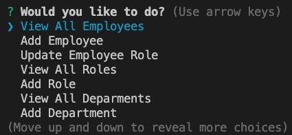
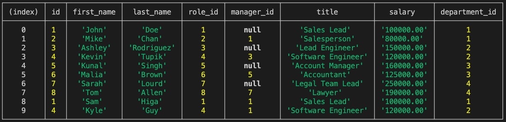
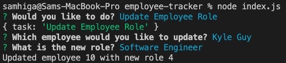
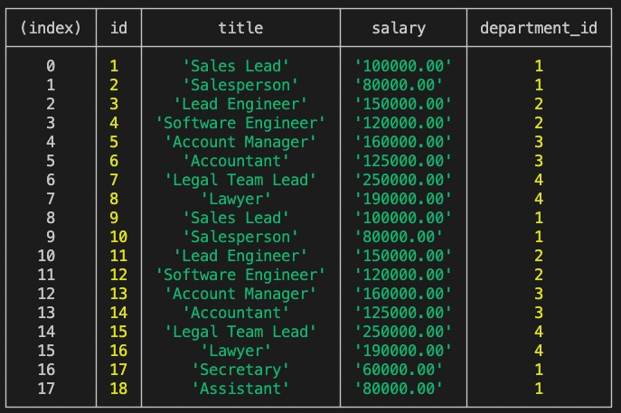
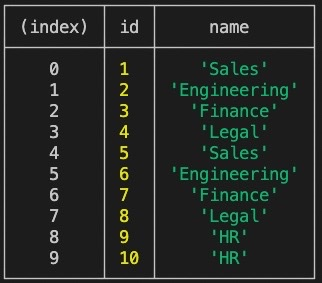

# employee-tracker

## Technology Used 

| Technology Used         | Resource URL           | 
| ------------- |:-------------:| 
| Git | [https://git-scm.com/](https://git-scm.com/)     | 
| Node.js | [https://nodejs.org/api/cli.html](https://nodejs.org/api/cli.html)   |
| MySQL | [https://www.mysql.com/](https://www.mysql.com/)   |
| NPM | [https://www.npmjs.com/](https://www.npmjs.com/)   |
| Inquirer | [https://www.npmjs.com/package/inquirer/v/8.2.4](https://www.npmjs.com/package/inquirer/v/8.2.4)   |
| mysql2 | [https://www.npmjs.com/package/mysql2](https://www.npmjs.com/package/mysql2)   |


## Description 

Please View the Walkthrough Video [https://drive.google.com/file/d/1AZt1NNpJ5JYkw5TOZriS2GYjSnq2EmNv/view]

This program stores employee information in a database. Users can reference the data via the CLI, they see information on different departments, different roles, and employee salaries, among others. They can also add employees, update their roles, add new roles, and add departments.


## Table of Contents 

* [Javascript Example](#javascript-example)
* [Usage](#usage)
* [Learning Points](#learning-points)
* [Author Info](#author-info)


## Javascript Example

To get a hold of this project, simply navigate to my Github profile and select the repo "employee-tracker". From there copy the SSH link into your terminal, Gitbash, or whatever application you prefer and use git copy and then paste the link. You can then open it using VS Code and run it using node.


```javascript
  .then(function(answer){
        console.log(answer)
        if (answer.task === "View All Employees"){
          connection.query("SELECT * FROM employee INNER JOIN role ON employee.role_id = role.id", function(err, result){
            if (err) throw err;
            console.table(result)
            runProgram()
          })
        }
        if (answer.task === "View All Deparments"){
          connection.query("SELECT * FROM department", function(err, result){
            if (err) throw err;
            console.table(result)
            runProgram()
          })
        }
```

In the above code, I used if statements and connection.query to display whatever the user prompted.

```javascript
  {
              type: "list",
              name: "role_id",
              message: "What is their role ?",
              choices: Object.keys(roles).map(key => ({
                name: `${roles[key]} (${key})`,
                value: key
              }))
            },
```

In order to make it so users can select the actual name of the role instead of just a number, I created an array that contained the roles and their corresponding numbers. Using object.keys, I then was able to link it so that array displayed as the choices while still updating the db properly.


## Usage 
To use the employee tracker, you must first acquire it through GitHub, see above how to do this. After you open it in VS Code, you may then use your computer's terminal or the terminal in VS Code. Make sure you are inside this repository in the terminal, the run node index.js to begin. You will then be prompted to a menu to view and change items. Just select what you want to do using the arrow keys and follow the prompts.


</br>

</br>
</br>
</br>


## Learning Points 


Through this project, I got a good chance to use Inquirer again. I also got a good amount of experience working with SQL and mysql2 databases and how to implement them into a project.


## Author Info


### Sam Higa 


* [Portfolio](https://samhiga.github.io/my-portfolio/)
* [LinkedIn](https://www.linkedin.com/in/sam-higa-b887b9209/)
* [Github](https://github.com/samhiga)